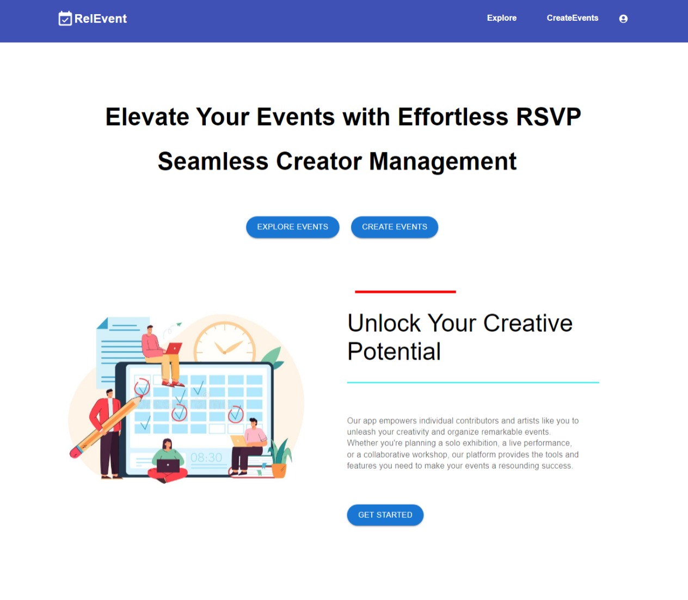
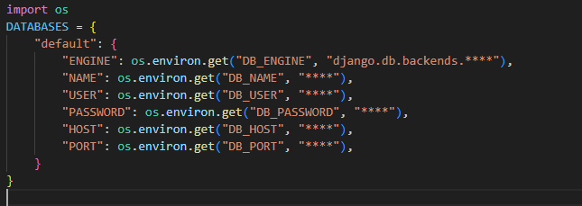
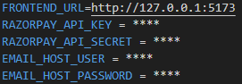
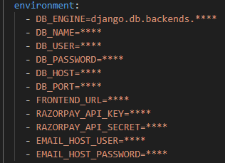

# REL-EVENT (Backend)
### About Project


Struggling with event management complexities? Existing systems often leave users frustrated with convoluted interfaces and cumbersome processes. Our Event Management System __REL-EVENT__ revolutionizes event organization, attendee registration, and volunteer coordination, offering an intuitive platform that simplifies the entire process. With streamlined event creation, seamless attendee registration, and efficient volunteer management, Rel-Event bridges the gap between organizers, attendees, and volunteers, ensuring a smooth and hassle-free experience for all. It even let's all the users to perform all the roles. Join us in redefining event management

(The following code is only for the backend. For frontend use [RelEvent Frontend](https://github.com/siddarthal/AlphaProject.git "AlphaProject"))

## Running the App
<p>Usage of this application can be done in three ways.</p>
<p> The first would be running it in the localhost of your system where you and only you can access the application.</p>
<p>The second way is to host it on any cloud service like AWS with the help of containerzation tool such as Docker.</p>
<p>The next type is to use Jenkins for CI/CD.</p>

## Localhost
<p>To run the application in the localhost it is required to have Python 3.9 or above in the system</p>

### Step 1
<p>Download the project code into your system and unzip it.</p>
<p>OR</p>
<p>Clone the repo from the github by using the following command:</p>

```bash
git clone https://github.com/Anirudh-B-Mitta/rel_event.git
```

### Step 2
Navigate into the project, create virtual environment and activate it
```sh
python -m venv <virtual env name> #create venv
<virtual env name>\Scripts\activate  #activate venv
```

### Step 3
Navigate into `rel_event/rel_event` you will find `settings.py` Add your database details such as username, password etc. in place of `****`



Create a `.env` file in the root of the project and type the following:



Fill the `****` with your details.

### Step 4
In the terminal use the given command and migrate the details to the database. This creates a schema of the required tables.
```sh
python manage.py migrate
```

### Step 5
Now you are ready to run the application. Use the below command:
```sh
python manage.py runserver
```
This command runs in the port `8000` if you want to run on different port then use:
```sh
python manage.py runserver 0.0.0.0:<port number>
```
Go to browser and type __127.0.0.1:8000__ to see your application.

__Hurray!! It's running__

#### NOTE: This is only the backend and can be used through Postman. For UI refer [RelEvent Frontend](https://github.com/siddarthal/AlphaProject.git)

## Docker Container
The second type of running the application is through Docker. The below steps are given assuming `Docker` and `docker-compose` are installed.

### Step 1
<p>Download the project code into your system and unzip it.</p>
<p>OR</p>
<p>Clone the repo from the github by using the following command:</p>

```bash
git clone https://github.com/Anirudh-B-Mitta/rel_event.git
```

### Step 2
There is a Dockerfile in the project's root directory. Build a Docker Image using the given file, using the below command:
```sh
docker build -t backend-dango:latest .
```
### Step 3
There is a `backend.yaml` file attached in the code. Replace the `****` with your details for environment variables.



.png "Backend.yaml")

### Step 4
Run the docker-compose file, using the below command:
```sh
docker-compose -f backend.yaml up -d
```

Go to browser and type __\<your IP>:8002__ to see your application

__TaDa!! It's working__

#### NOTE: This is only the backend and can be used through Postman. For UI refer [RelEvent Frontend](https://github.com/siddarthal/AlphaProject.git)

## Jenkins
The next type for hosting the application is through Jenkins. Here you can connect it to your git and trigger the build for every change you make.

The below steps are given assuming Jenkins, Docker and docker-compose are installed.

### Step 1
Clone the github repository and add it to your github

### Step 2
Create a Free-style project in Jenkins and configure it with following details:
- Give your description
- Select Github Project and give your project url
- In source code management select git, give your repository url followed by credentials related to it. Specify the branch to be built.
- Go to build triggers and check `Github Hook triggers`
- In the Build steps select `Execute shell` and type the following:
```sh
cd rel_event
docker-compose -f backend.yaml down
docker rmi backend-django:latest || true
docker build -t backend-django:latest .
docker-compose -f backend.yaml up -d
```
- Apply and Save the configuration
- Build manually for the first time, from next time whenever a git push is done it gets triggered automatically.

__Use the application by typing `<your IP>:8002` in the browser or Postman__